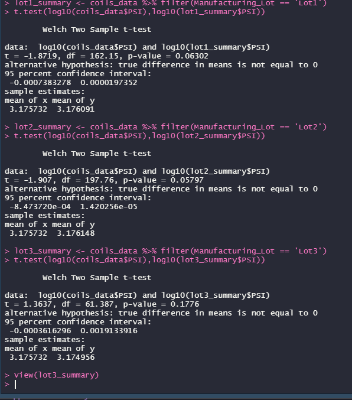

# mechacar_statistical_analysis_UT_DATA

# Overview
AutosRUs' newest prototype, the MechaCar, is suffering from production troubles that are blocking the manufacturing team's progress. AutosRUs' upper management has called on Jeremy and the data analytics team to review the production data for insights that may help the manufacturing team.

Contains the following:

- Perform multiple linear regression analysis to identify which variables in the data set predict the mpg of MechaCar prototypes
- Collect summary statistics on the pounds per square inch (PSI) of the suspension coils from the manufacturing lots
- Run t-tests to determine if the manufacturing lots are statistically different from the mean population
- Design a statistical study to compare vehicle performance of the MechaCar vehicles against vehicles from other manufacturers. For each statistical analysis, you'll write a summary interpretation of the findings.

## Linear Regression to Predict MPG
#### Which variables/coefficients provided a non-random amount of variance to the mpg values in the dataset?
  - vehicle_length
  - ground_clearance
  - vehicle_weight
#### Is the slope of the linear model considered to be zero? Why or why not?
  - The p-value of our linear regression analysis is 5.35e-11, which is much smaller than our assumed significance level of 0.05%. Therefore, we can state that there is sufficient evidence to reject our null hypothesis, which means that the slope of our linear model is not zero.
#### Does this linear model predict mpg of MechaCar prototypes effectively? Why or why not?
  - Multiple R-squared:  0.71
  - The lack of significant variables is evidence of over fitting within the current data set, and thus this model fails to generalize and predict future data correctly.

## Summary Statistics on Suspension Coils
#### The design specifications for the MechaCar suspension coils dictate that the variance of the suspension coils must not exceed 100 pounds per square inch. Does the current manufacturing data meet this design specification for all manufacturing lots in total and each lot individually? Why or why not?
  - Yes, the total and all 3 lots perform as near identical subsets of the total and the total summary shows that the vehicles are meeting the PSI standards.
  
## T-Tests on Suspension Coils
 - **Lot 1** The p-value is above the assumed significance level. Therefore, we would state that there is not enough evidence to reject the null hypothesis and we can confirm our two samples are not statistically different.
 - **Lot 2** The p-value is above the assumed significance level. Therefore, we would state that there is not enough evidence to reject the null hypothesis and we can confirm our two samples are not statistically different.
 - **Lot 3** The p-value is above the assumed significance level. Therefore, we would state that there is not enough evidence to reject the null hypothesis and we can confirm our two samples are not statistically different.

**T Tests**

## Study Design: MechaCar vs Competition
### Description of study

- What metric or metrics are you going to test?
  - manufacturer
  - number of models offered with high city efficiency (mpg)
  - number of models offered with high highway efficiency (mpg)
  - total units sold by manufacturer
  - location
  - date
- What is the null hypothesis or alternative hypothesis?
  - Do consumers buy cars from manufacturers that offer a higher quantity of "fuel efficient" models, regardless of cost? Consumers will purchase from a manufacturer that they feel is more "Eco-conscience", regardless of what vehicle they actually purchase from that given manufacturer.
- What statistical test would you use to test the hypothesis? And why?
  - Linear Regression will be used to see if vehicles sold within a similar date and location are impacted in a statistically meaningful way based on the number of fuel efficient models that a given manufacturer offers.
- What data is needed to run the statistical test?
  - A population of all new auto sales in a region and time period across multiple manufacturers, and the number of fuel efficient models that each manufacturer is selling at the time of each vehicle purchase.

